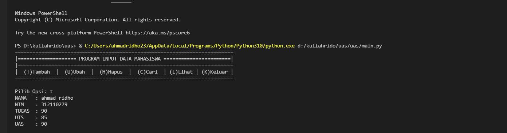
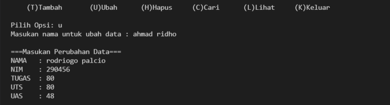
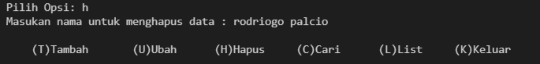
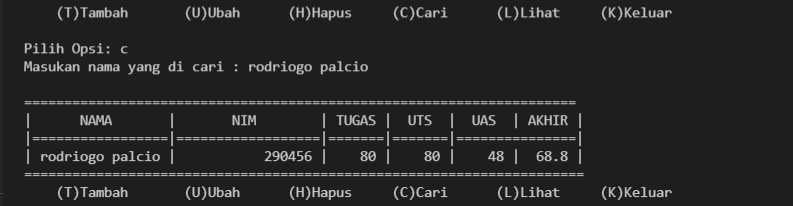

# __ULANGAN AKHIR SEMESTER__ 
### __nama__ : __ahamd ridho__
### __nim__  : __312110279__
### __kelas__ : __TI.21.C.1__

----------------------------------------------------------------------------------------------------------------------------------------------
## **Berikut langkah-langkah nya** 
##   __di file _model_ berisi__  :
__Daftar_nilai.py  yang digunakan  untuk:__
                                        
 - Tambah Data, 
 - Ubah Data
 - Hapus Data
 - Cari Data

## __di file _view_ berisi__ :
  ## **_view_nilai.py_ yang digunakan  untuk**
- cetak_daftar_nilai
-  cetak_hasil_pencarian
## **__input_nilai.py__ yang digunakan untuk** 
- __input_data__ (yang meminta pengguna memasukkan data).

 ## __main.py berisi program utama__ 
 - (_menu pilihan yang memanggil semua menu yang tersedia_ ).

## **Berikut Tampilan hasil dari Program nya**

### __1. Tambah Data__

### __2. Ubah Data__

### __3. Hapus Data__

### __4.Cari Data__

